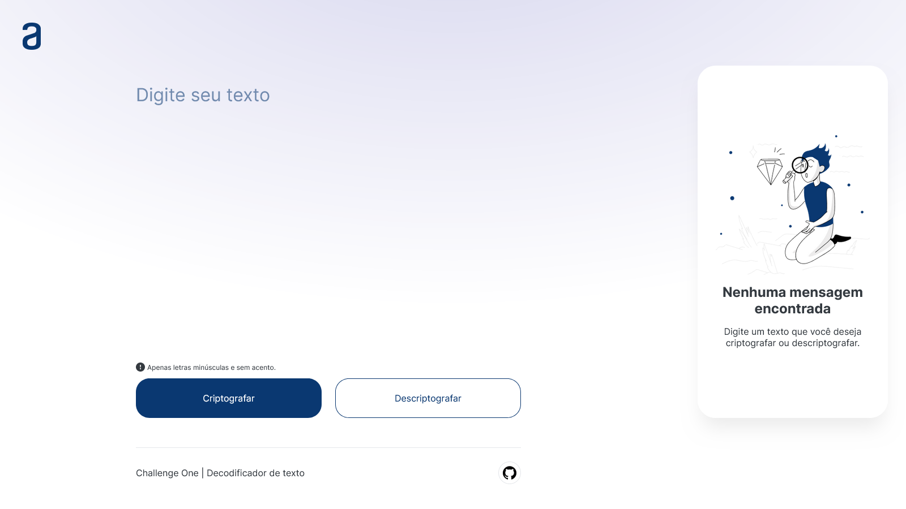

<h1 align="center">Alura Challenges  Oracle ONE</h1>
<h4 align="center">Codificador e decodificador de texto</h4>

<div align="center">



</div>

## Como rodar o projeto localmente

Para clonar e rodar esta aplicação em sua maquina localmente, você precisará do [Git](https://git-scm.com)

```bash
# Clonar esse repositório
git clone https://github.com/MatheusVSN/Decodificador-de-Texto---Alura-Challenges-Oracle-ONE
```

Com o repositório baixado, você pode executar o arquivo `index.html` e seu navegador irá executar a aplicação para você
